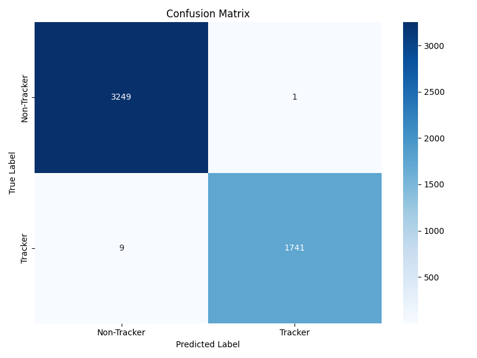
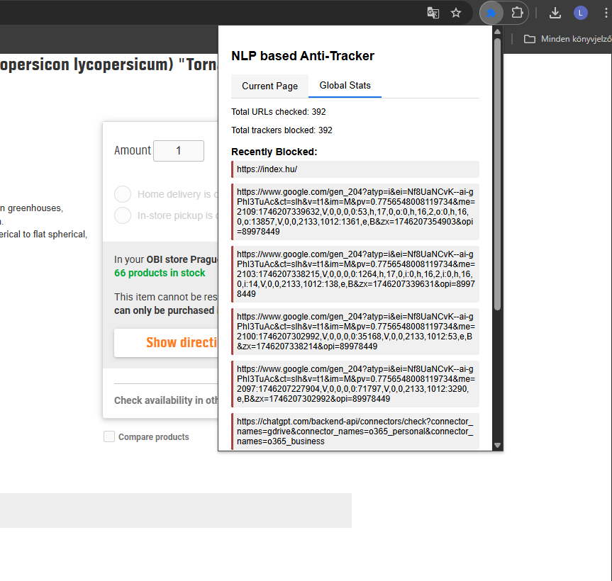

# 🛡️ Be TrackLess

A repository containing the code, data, and trained models for developing an **NLP-powered anti-tracking Chrome extension**.

---

## About

### NLP for Enhanced Anti-Tracking in Web Browsers

#### Abstract

Online tracking poses a persistent threat to user privacy. Existing solutions offer some protection but often lack adaptability, comprehensive coverage, and high precision. This project leverages NLP to build a robust, adaptive, and efficient anti-tracking system.

By fine-tuning transformer-based models like DistilBERT, we aim to detect sophisticated tracking patterns in URLs, network requests, and web page content. Semantic understanding allows our model to minimize false positives and maximize detection accuracy.

We address practical challenges of deploying such models in browser environments—especially around real-time inference performance, integration constraints, and scalability.

---

## Code and Data

### Clone the Repository

```bash
git clone https://github.com/relew/AI-ML-ProjectLab/tree/main/NLP-trackless-extension
cd NLP-trackless-extension
```

### Trained Model

Download the [original pre-trained DistilBERT model](https://drive.google.com/file/d/1FuDfbfiNawnfvTQJ5MZLdzBh5xGt1Bfq/view?usp=drive_link) and save it in the `./original_distilbert/` directory.

---

## ⚙️ Setup Instructions

### 1. Create a Virtual Environment

```bash
python -m venv trackless-venv
source trackless-venv/bin/activate  # macOS/Linux
```

### 2. Install Dependencies

```bash
pip install -r requirements.txt
```

---

## How to Run

### 📊 Step-by-Step Pipeline

1. **Generate Training & Test Data**

```bash
python data_generator.py
```

2. **Train the Model**

```bash
python train_model.py
```

3. **Test the Model**

```bash
python test_model.py
```

4. **Evaluate Performance**
   Results include:

* Precision, Recall, F1 Score
* ROC AUC
* Confusion Matrix (saved as `confusion_matrix.png`)
Results from model evaluation are shown in `confusion_matrix.png`. 


---


## 🧬 Model Details

* **Architecture**: `distilbert-base-uncased`
* **Optimizer**: `adamw_torch`
* **Max Sequence Length**: 64 tokens
* **Batch Size**: 8 (CPU) / 32 (GPU)

---

## Inputs

* **Tracker Dataset**: Manually refresh the EasyPrivacy list from [EasyList](https://easylist.to/). Save it as a `.txt` file.

---

## 🌐 API Usage (via Flask)

### Run the REST API

```bash
python app.py
```

### Example Request (Python)

```python
import requests

url = "http://localhost:5000/predict"
data = {"url": "https://tracking.badsite.com/ads?id=123"}
response = requests.post(url, json=data)
print(response.json())
```

### Sample Response

```json
{
  "tracker": true,
  "confidence": 0.92
}
```

---

## 🧩 Chrome Extension Integration

1. Run the API:

```bash
python app.py
```

2. Open Chrome and navigate to `chrome://extensions`
3. Enable **Developer Mode**
4. Click **Load Unpacked** and select the `browser-extension/` directory
5. Extension should now be active and visible in your browser toolbar



---


© 2025 Be TrackLess Project